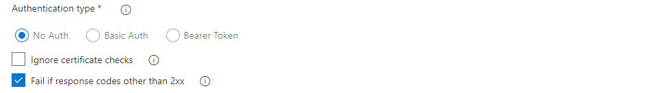

## Download a file
This extension provide the ability to download a binary file using protocol HTTP or HTTPS.

Parameters :
- **Download URL**: Enter the url of the file to download (http or https protocols are supported).
- **Target path folder**: Directory to save the file (Will be created if he doesn\'t exist).
- **Target file name**: Rename target file.
- **Authentication type**: Define which authentication methods.
- **Ignore certificate checks**: Ignore errors from certificate checks.
- **Fail if response codes other than 2xx**: Fail task if the HTTP response code is not 2xx.

## Authentication modes

### No Auth

### Basic Auth

Parameters :
- **Username**: Username for the Basic Authentication.
- **Password**: Password for the Basic Authentication.

### Bearer Token

Parameters :
- **Token**: Token for the Bearer Token Authentication.

## Release note

### v2.0.0
- Handle HTTP error 301 and 303
- Update task to Node 10

### v1.0.6
- Improve errors management

### v1.0.5
- Fix dependency bug introduced in v1.0.3

### v1.0.3
- Fix : Set default authentication to 'none'

### v1.0.2
- First release