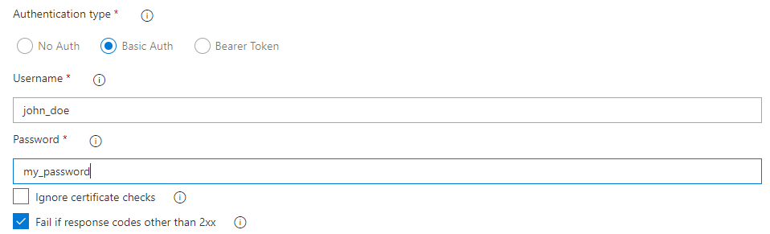

## Download a file
This extension provide the ability to download a binary file using protocol HTTP or HTTPS.

Parameters :
- **Download URL**: Enter the url of the file to download (http or https protocols are supported).
- **Target path folder**: Directory to save the file (Will be created if he doesn\'t exist).
- **Target file name**: Rename target file.
- **Authentification type**: Define which authentication methods.
- **Ignore certificate checks**: Ignore errors from certificate checks.
- **Fail if response codes other than 2xx**: Fail task if the HTTP response code is not 2xx.

## Authentification modes

### No Auth

### Basic Auth

Parameters :
- **Username**: Username for the Basic Authentification.
- **Password**: Password for the Basic Authentification.

### Bearer Token

Parameters :
- **Token**: Token for the Bearer Token Authentification.